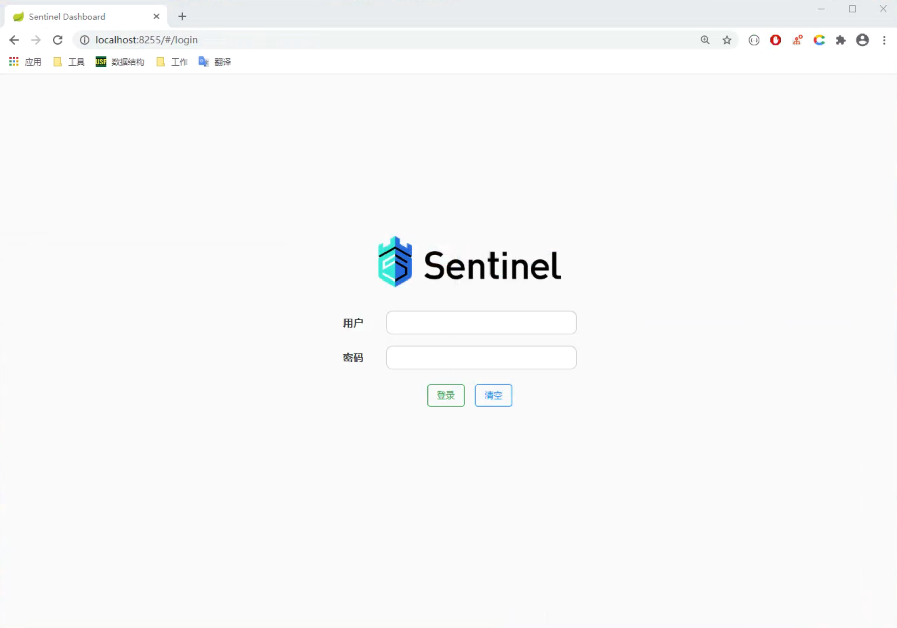
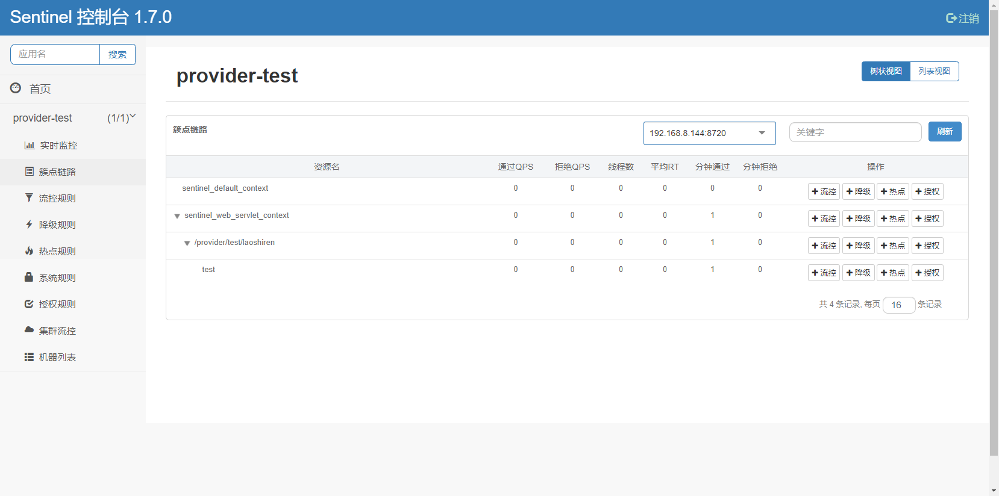
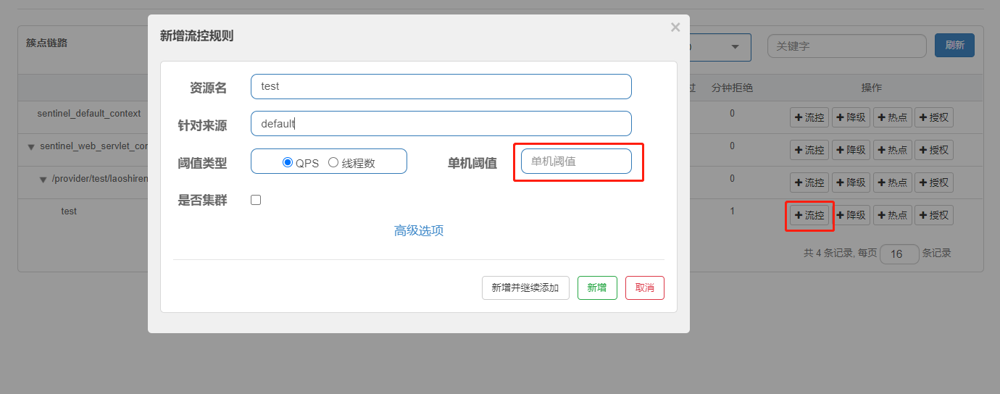
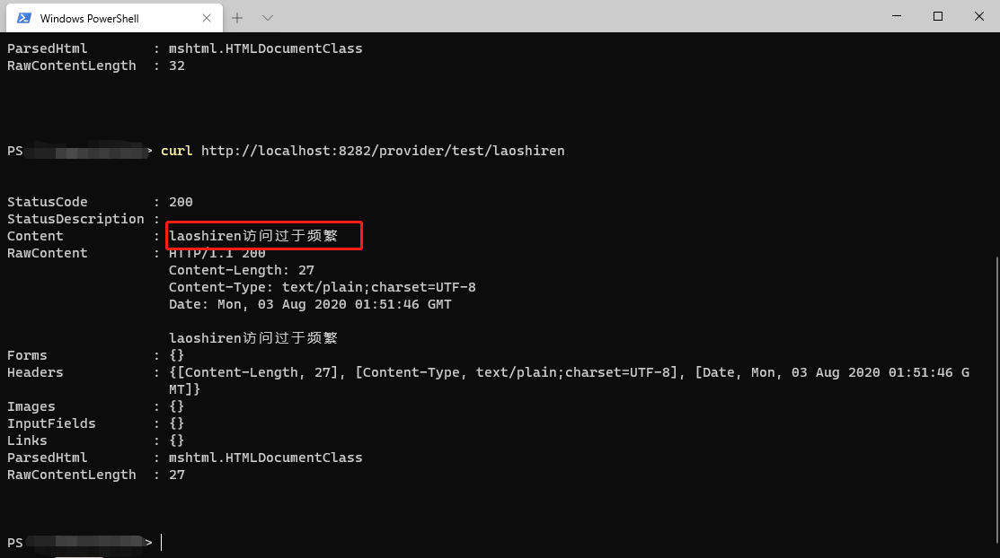
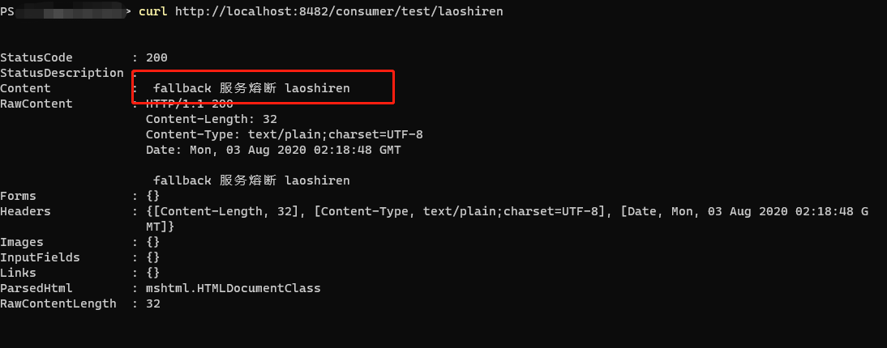

## Sentinel 

###  前言

在学习`SpringCloud Netflix`的过程中，服务与服务之间的调用我们会去使用`Ribbon`或者是`Feign`的方式，但是微服务的开发本身就具有很多问题。比如网络问题，网络是不可靠的，所以当服务变得不可靠时，我们需要去自我保护，`Netflix`的开源组件`Hystrix`就派上用场了。

[Hystrix原理和实战](https://blog.csdn.net/loushuiyifan/article/details/82702522)

那我们都知道`Netflix`已经在很久之前就不再更新了，那我们就全面转向`SpringCloud Alibaba`，使用`Sentinel`。

### 什么是Sentinel

> 随着微服务的流行，服务和服务之间的稳定性变得越来越重要。Sentinel 以流量为切入点，从流量控制、熔断降级、系统负载保护等多个维度保护服务的稳定性。

`Sentinel` 具有以下特征:

- **丰富的应用场景**：`Sentinel` 承接了阿里巴巴近 10 年的双十一大促流量的核心场景，例如秒杀（即突发流量控制在系统容量可以承受的范围）、消息削峰填谷、集群流量控制、实时熔断下游不可用应用等。
- **完备的实时监控**：`Sentinel` 同时提供实时的监控功能。您可以在控制台中看到接入应用的单台机器秒级数据，甚至 500 台以下规模的集群的汇总运行情况。
- **广泛的开源生态**：`Sentinel` 提供开箱即用的与其它开源框架/库的整合模块，例如与 `Spring Cloud`、`Dubbo`、`gRPC` 的整合。您只需要引入相应的依赖并进行简单的配置即可快速地接入 `Sentinel`。
- **完善的 SPI 扩展点**：`Sentinel` 提供简单易用、完善的`SPI`扩展接口。您可以通过实现扩展接口来快速地定制逻辑。例如定制规则管理、适配动态数据源等。

主要特性

### 为什么使用Sentinel

首先`Netflix`已经不更新了，其次这是阿里巴巴出的一款熔断限流组件，相对`Hystrix`有良好的可视化界面。而且该项目高达`13.2k`的`Star`，学习使用起来可以参照文档快速上手。

[github地址 alibaba/Sentinel](https://github.com/alibaba/Sentinel)

### 如何使用Sentinel

#### 服务端

首先第一步克隆项目。

~~~shell 
git clone https://github.com/alibaba/Sentinel.git
# 打包编译运行项目
cd Sentinel
mvn clean package 
# 第一次构建需要巨长的时间
cd ./sentinel-dashboard/target
~~~

运行项目

~~~shell
# 修改端口 默认是8080，
# 修改登录密码 在1.6以后需要登录默认账号密码是 sentinel和sentinel

java -Dserver.port=8255 -Dsentinel.dashboard.auth.password=123456 -jar sentinel-dashboard.jar 
~~~

正常启动后访问[localhost:8255/#/login](http://localhost:8255/#/login)

用户名`sentinel`密码`123456`

这个就是我们的`sentinel`服务端了。上面什么都没有不用管它，因为他是面向流量的一款组件，没有访问任何接入`sentinel`接口当然什么都没有。

#### 客户端

按照惯例我们会创建2个项目一个服务提供者一个服务消费者。 服务注册与发现我们使用`nacos`

##### 服务提供者，接入sentinel
简单创建一个`springboot`项目接入`nacos`就行，
引入依赖
~~~xml 
<dependency>
    <groupId>com.alibaba.cloud</groupId>
    <artifactId>spring-cloud-starter-alibaba-sentinel</artifactId>
</dependency>
~~~
修改配置文件
~~~yaml 
spring:
  cloud:
    sentinel:
      transport:
        dashboard: localhost:8255
~~~
使用`@SentinelResource`注解
~~~java 
@GetMapping("/test/{name}")
@SentinelResource(value = "test", blockHandler = "blockExceptionHandler")
public String test(@PathVariable(value = "name") String name){
    System.out.println("provider");
    return "hello "+name+" 这是生产者 ";
}

public String blockExceptionHandler(String name ,BlockException e) {
    e.printStackTrace();
    System.out.println("访问过于频繁");
    return name + "访问过于频繁";
}
~~~
`blockHandler`表示限流异常处理，我们通过`sentinel`限流后，会执行`blockHandler`的方法，方法签名最好重写该接口。
请求一次该接口。
~~~shell 
curl http://localhost:8282/provider/test/laoshiren
~~~

进行单个接口控流

`QPS`不用解释吧，每秒查询率设置为1，在1秒内请求2次该接口。

##### 服务消费者
创建好一个服务消费者后我们要接入`Sentinel`,引入依赖
~~~xml 
<dependency>
    <groupId>com.alibaba.cloud</groupId>
    <artifactId>spring-cloud-starter-alibaba-sentinel</artifactId>
</dependency>
~~~
修改配置文件
~~~yaml 
spring:
  cloud:
    # 熔断限流
    sentinel:
      transport:
        dashboard: localhost:8050
# 开启 Feign 对 Sentinel 的支持
feign:
  sentinel:
    enabled: true
~~~
`Feign接口` 指定熔断的实现`ProviderTestServiceFallBack.class`
~~~java 
import com.laoshiren.hello.sentinel.consumer.service.fallback.ProviderTestServiceFallBack;
import org.springframework.cloud.openfeign.FeignClient;
import org.springframework.web.bind.annotation.GetMapping;
import org.springframework.web.bind.annotation.PathVariable;

/**
 * ProjectName:     hello-sentinel
 * Package:         com.laoshiren.hello.sentinel.consumer.service
 * ClassName:       ProviderTestService
 * Author:          laoshiren
 * Description:
 * Date:            2020/8/2 12:06
 * Version:         1.0
 */
@FeignClient(value = "provider-test",fallback = ProviderTestServiceFallBack.class)
public interface ProviderTestService {

    @GetMapping("provider/test/{name}")
    String test(@PathVariable(value = "name")String name);

}
~~~
~~~java 
@Component
public class ProviderTestServiceFallBack implements ProviderTestService {

    @Override
    public String test(String name) {
        return " fallback 服务熔断 "+name;
    }
}
~~~
关闭生产者，仅仅启动消费者，访问接口
~~~shell 
curl http://localhost:8482/consumer/test/laoshiren
~~~

当然不关闭，在2秒内请求同一个接口，也会触发限流

### 总结
了解开始使用了`alibaba`，所以我的熔断限流就使用了`sentinel`，这个只是一片`sample`形式的项目，实际生产还得结核公司环境等一些因素做出对应的改变。
反正天下有太多难学的技术，广泛的学习还是很有必要的。

